# sac-agent4j Class Diagram

This diagram records the class shape after introducing `AgentRun`, `ActionDispatcher`, `StateActionHandler`, the `ControlAction` / `StateAction` / `ToolAction` hierarchy, and the `ContextManager` prompt seam.

For architectural commentary, see [`ARCHITECTURE.md`](./ARCHITECTURE.md).

```mermaid
classDiagram
    direction LR

    class Main {
      +call() Integer
      +main(args) void
    }

    class AgentLoop {
      -LlmClient llmClient
      -ActionDispatcher actionDispatcher
      -ContextManager contextManager
      -TrajectoryLogger trajectoryLogger
      -SessionRecorder sessionRecorder
      -int maxSteps
      -AgentRun lastRun
      +run(task) AgentResult
      +run(run) AgentResult
      +state() AgentState
      +plan() List~TodoItem~
    }

    class AgentRun {
      -String task
      -int maxSteps
      -AgentState state
      -List~Turn~ history
      -int nextStep
      +start(task, maxSteps) AgentRun
      +resume(task, maxSteps, state, history) AgentRun
      +hasStepsRemaining() boolean
      +record(action, observation) Turn
      +finished(summary) AgentResult
      +stopped() AgentResult
    }

    class ActionDispatcher {
      -StateActionHandler stateActionHandler
      -ToolActionHandler toolActionHandler
      -ToolContext toolContext
      +dispatch(action, run) Observation
    }

    class StateActionHandler {
      +execute(stateAction, state) Observation
    }

    class ContextManager {
      <<interface>>
      +buildPrompt(run) Prompt
    }

    class DefaultContextManager {
      -SystemPromptRenderer systemPromptRenderer
      -ActionProtocolRenderer actionProtocolRenderer
      -TaskRenderer taskRenderer
      -AgentStateRenderer agentStateRenderer
      -HistoryRenderer historyRenderer
      +buildPrompt(run) Prompt
    }

    class Prompt {
      +String system
      +String actionProtocol
      +String task
      +String agentState
      +String history
      +render() String
    }

    class SystemPromptRenderer
    class ActionProtocolRenderer
    class TaskRenderer
    class AgentStateRenderer
    class HistoryRenderer

    class LlmClient {
      <<interface>>
      +nextAction(context) Action
    }

    class JsonLineLlmClient
    class OpenAiCompatibleLlmClient
    class ScriptedLlmClient

    class ActionCatalog {
      +examples() List~Example~
      +exampleJsonLines(objectMapper) List~String~
      +runtimeTypesByClass() Map~Class,String~
    }

    class ActionExample {
      +String type
      +Class actionClass
      +Action action
    }

    class Action {
      <<sealed interface>>
    }

    class ControlAction {
      <<sealed interface>>
    }

    class StateAction {
      <<sealed interface>>
    }

    class ToolAction {
      <<sealed interface>>
    }

    class SetPlan
    class UpdateTodo
    class WriteVirtualFile
    class ReadVirtualFile
    class OffloadContext
    class ReadContext
    class ReadFile
    class Search
    class Shell
    class ApplyPatch
    class RunTests
    class Finish

    class Observation {
      +int exitCode
      +String output
      +ok(output) Observation
      +failed(output) Observation
    }

    class Turn {
      +Action action
      +Observation observation
    }

    class AgentResult {
      +boolean finished
      +String summary
      +List~Turn~ history
    }

    class AgentState {
      -TodoList todoList
      -VirtualFileSystem virtualFileSystem
      -ContextOffloadStore contextOffloads
      +todoList() TodoList
      +virtualFileSystem() VirtualFileSystem
      +contextOffloads() ContextOffloadStore
      +plan() List~TodoItem~
      +virtualFileSummary() Map~String,Integer~
      +contextSummary() Map~String,String~
    }

    class TodoList {
      -List~TodoItem~ items
      +setPlan(items) Observation
      +updateTodo(id, status) Observation
      +items() List~TodoItem~
      +render() String
    }

    class TodoItem {
      +int id
      +String content
      +TodoStatus status
    }

    class TodoStatus {
      <<enum>>
      pending
      in_progress
      completed
      cancelled
    }

    class VirtualFileSystem {
      -Map~String,String~ files
      +write(path, content) Observation
      +read(path) Observation
      +summary() Map~String,Integer~
    }

    class ContextOffloadStore {
      -Map~String,Entry~ entries
      -int nextId
      +offload(key, title, content) Observation
      +read(key) Observation
      +summary() Map~String,String~
    }

    class ToolActionHandler {
      -ToolRegistry registry
      -PermissionGate permissionGate
      +execute(toolAction, context) Observation
    }

    class ToolRegistry {
      -List~Tool~ tools
      +defaultRegistry() ToolRegistry
      +find(toolAction) Tool
      +names() List~String~
    }

    class Tool {
      <<interface>>
      +name() String
      +risk() RiskLevel
      +supports(toolAction) boolean
      +execute(toolAction, context) Observation
    }

    class PermissionGate {
      <<interface>>
      +check(tool, action, context) PermissionDecision
    }

    class DefaultPermissionGate

    class PermissionDecision {
      +boolean allowed
      +String reason
    }

    class RiskLevel {
      <<enum>>
      LOW
      MEDIUM
      HIGH
    }

    class ToolContext {
      +Workspace workspace
      +String testCommand
      +ToolPolicy toolPolicy
    }

    class ReadFileTool
    class SearchTool
    class ShellTool
    class ApplyPatchTool
    class RunTestsTool

    class ProcessRunner {
      +runShell(workingDirectory, command, timeout) Observation
      +run(workingDirectory, command, timeout, stdin) Observation
    }

    class ToolPolicy {
      -List~Pattern~ deniedShellPatterns
      +defaultPolicy() ToolPolicy
      +allowAll() ToolPolicy
      +checkShell(command) PermissionDecision
    }

    class Workspace {
      -Path root
      +root() Path
      +resolveExisting(path) Path
      +resolveForWrite(path) Path
    }

    class TrajectoryLogger {
      <<interface>>
      +started(task, maxSteps)
      +turn(step, action, observation)
      +finished(finished, summary, turns)
      +close()
    }

    class JsonlTrajectoryLogger
    class NoopTrajectoryLogger

    class SessionRecorder {
      <<interface>>
      +started(task, maxSteps)
      +turn(step, action, observation)
      +finished(finished, summary, turns)
      +close()
    }

    class JsonlSessionRecorder {
      +resume(objectMapper, path, leafId) JsonlSessionRecorder
    }

    class NoopSessionRecorder

    class JsonlSessionReader {
      +read(objectMapper, path) SessionDocument
    }

    class JsonlSessionCatalog {
      +list(objectMapper, root) List~SessionListItem~
    }

    class SessionListItem {
      +render() String
    }

    class JsonlSessionAnnotator {
      +note(objectMapper, sessionPath, entryId, title, body) String
    }

    class JsonlSessionForker {
      +fork(objectMapper, session, entryId, outputDir) Path
    }

    class SessionHandoff {
      +render(document, entryId) String
    }

    class SessionReplay {
      +from(objectMapper, path, entryId) SessionReplay
      +toAgentRun(maxSteps) AgentRun
    }

    class SessionDocument {
      +sessionId() String
      +leafId() String
      +ancestryTo(entryId) List~SessionEntry~
      +tree() SessionTree
      +summary() SessionSummary
    }

    class SessionEntry
    class SessionSummary
    class SessionTree {
      +render() String
    }

    Main --> AgentLoop : wires
    AgentLoop --> AgentRun : starts/advances
    AgentLoop --> LlmClient : asks next action
    AgentLoop --> ContextManager : builds prompt
    ContextManager <|.. DefaultContextManager
    DefaultContextManager --> Prompt
    DefaultContextManager --> SystemPromptRenderer
    DefaultContextManager --> ActionProtocolRenderer
    ActionProtocolRenderer --> ActionCatalog
    ActionCatalog *-- ActionExample
    ActionCatalog --> Action
    DefaultContextManager --> TaskRenderer
    DefaultContextManager --> AgentStateRenderer
    DefaultContextManager --> HistoryRenderer
    AgentLoop --> ActionDispatcher : dispatches non-terminal actions
    AgentLoop --> TrajectoryLogger : records events
    AgentLoop --> SessionRecorder : records session tree
    Main --> SessionReplay : resumes
    Main --> JsonlSessionRecorder : appends continuation

    AgentRun *-- AgentState
    AgentRun *-- Turn
    AgentRun --> AgentResult
    SessionReplay --> AgentRun
    SessionReplay --> SessionDocument
    SessionReplay --> StateActionHandler

    ActionDispatcher --> StateActionHandler
    ActionDispatcher --> ToolActionHandler
    ToolActionHandler --> ToolRegistry
    ToolActionHandler --> PermissionGate
    ToolActionHandler --> ToolContext
    PermissionGate <|.. DefaultPermissionGate
    ToolRegistry --> Tool
    Tool <|.. ReadFileTool
    Tool <|.. SearchTool
    Tool <|.. ShellTool
    Tool <|.. ApplyPatchTool
    Tool <|.. RunTestsTool
    Tool --> RiskLevel
    ShellTool --> ProcessRunner
    ApplyPatchTool --> ProcessRunner
    RunTestsTool --> ProcessRunner
    PermissionGate --> PermissionDecision
    StateActionHandler --> AgentState

    LlmClient <|.. JsonLineLlmClient
    LlmClient <|.. OpenAiCompatibleLlmClient
    LlmClient <|.. ScriptedLlmClient

    Action <|-- ControlAction
    Action <|-- StateAction
    Action <|-- ToolAction
    ControlAction <|.. Finish
    StateAction <|.. SetPlan
    StateAction <|.. UpdateTodo
    StateAction <|.. WriteVirtualFile
    StateAction <|.. ReadVirtualFile
    StateAction <|.. OffloadContext
    StateAction <|.. ReadContext
    ToolAction <|.. ReadFile
    ToolAction <|.. Search
    ToolAction <|.. Shell
    ToolAction <|.. ApplyPatch
    ToolAction <|.. RunTests

    Turn --> Action
    Turn --> Observation

    AgentState *-- TodoList
    AgentState *-- VirtualFileSystem
    AgentState *-- ContextOffloadStore
    AgentStateRenderer --> AgentState
    TodoList *-- TodoItem
    TodoItem --> TodoStatus

    ToolContext --> Workspace
    ToolContext --> ToolPolicy
    ToolPolicy --> PermissionDecision

    TrajectoryLogger <|.. JsonlTrajectoryLogger
    TrajectoryLogger <|.. NoopTrajectoryLogger
    SessionRecorder <|.. JsonlSessionRecorder
    SessionRecorder <|.. NoopSessionRecorder
    JsonlSessionReader --> SessionDocument
    JsonlSessionCatalog --> JsonlSessionReader
    JsonlSessionCatalog --> SessionListItem
    JsonlSessionAnnotator --> JsonlSessionReader
    JsonlSessionForker --> JsonlSessionReader
    SessionHandoff --> SessionDocument
    SessionDocument *-- SessionEntry
    SessionDocument --> SessionSummary
    SessionDocument --> SessionTree
```



## Responsibility split

```text
AgentLoop          = time/control flow
AgentRun           = one run's lifecycle state
AgentState         = agent's inner world
Action             = typed model/runtime protocol
ActionCatalog      = tested model-visible protocol examples
ContextManager     = attention/context boundary
Prompt             = structured prompt sections
ActionDispatcher   = action family routing
StateActionHandler = state mutation/read semantics
ToolActionHandler  = tool registry + permission gate orchestration
ToolRegistry       = available workspace capabilities
PermissionGate     = risk boundary before tool execution
ToolActionHandler  = side-effect execution boundary
ProcessRunner      = command process adapter
LlmClient          = model boundary
TrajectoryLogger   = trace boundary
SessionRecorder    = Pi-style session-history boundary
SessionReplay      = rebuilds a run from session ancestry
SessionTree        = human-readable parent/child session lineage
```

## Why this is more OO than the previous shape

- `AgentLoop` no longer branches over every concrete action.
- `AgentLoop` depends on `ContextManager`, not a string-building concrete class.
- Prompt sections are represented by `Prompt` and independent renderers.
- `ActionCatalog` keeps `@JsonSubTypes` and model-visible examples in sync.
- The main runtime path now goes through `ToolActionHandler`, `ToolRegistry`, and `PermissionGate` directly.
- `ProcessRunner` centralizes process timeout, stdin, and stdout/stderr capture for command-backed tools.
- `AgentState` no longer accepts action records or renders prompt text; state mutation lives in `StateActionHandler`, and state presentation lives in `AgentStateRenderer`.
- `AgentRun` owns history, state, step budget, and run result construction.
- The Java sealed hierarchy now expresses action ontology directly.
