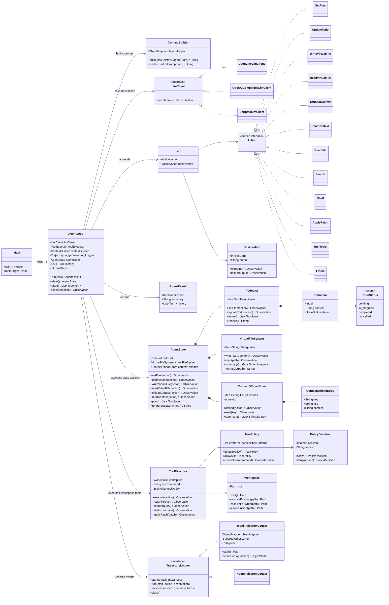
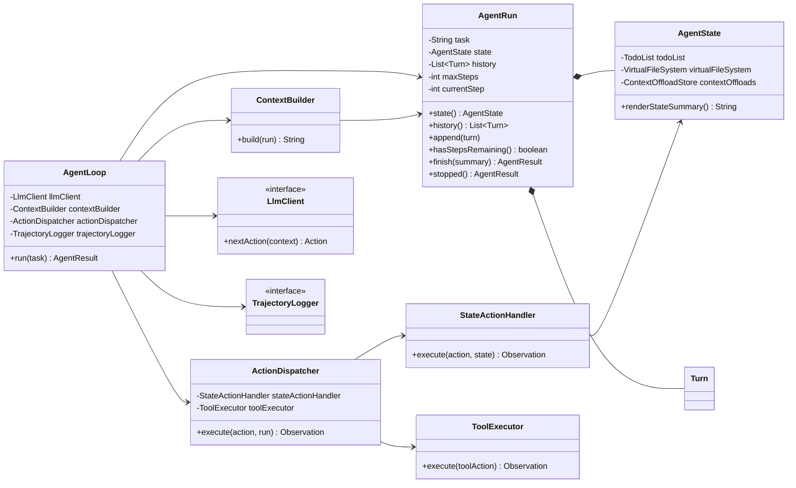

# sac-agent4j Class Diagram

This diagram records the current class shape after adding `AgentState`, virtual files, context offload, plan/todo actions, tool policy, and trajectory logging.

For architectural commentary and the next proposed OO refinement, see [`ARCHITECTURE.md`](./ARCHITECTURE.md).



## Proposed next class diagram

This is the recommended next OO refinement before adding heavier features such as subagents, skills, HITL, or checkpointing.



The intended responsibility split is:

```text
AgentLoop        = time/control flow
AgentRun         = one run's lifecycle state
AgentState       = agent's inner world
ActionDispatcher = action routing
StateActionHandler = state mutation/read semantics
ToolExecutor     = external workspace/tool side effects
```
