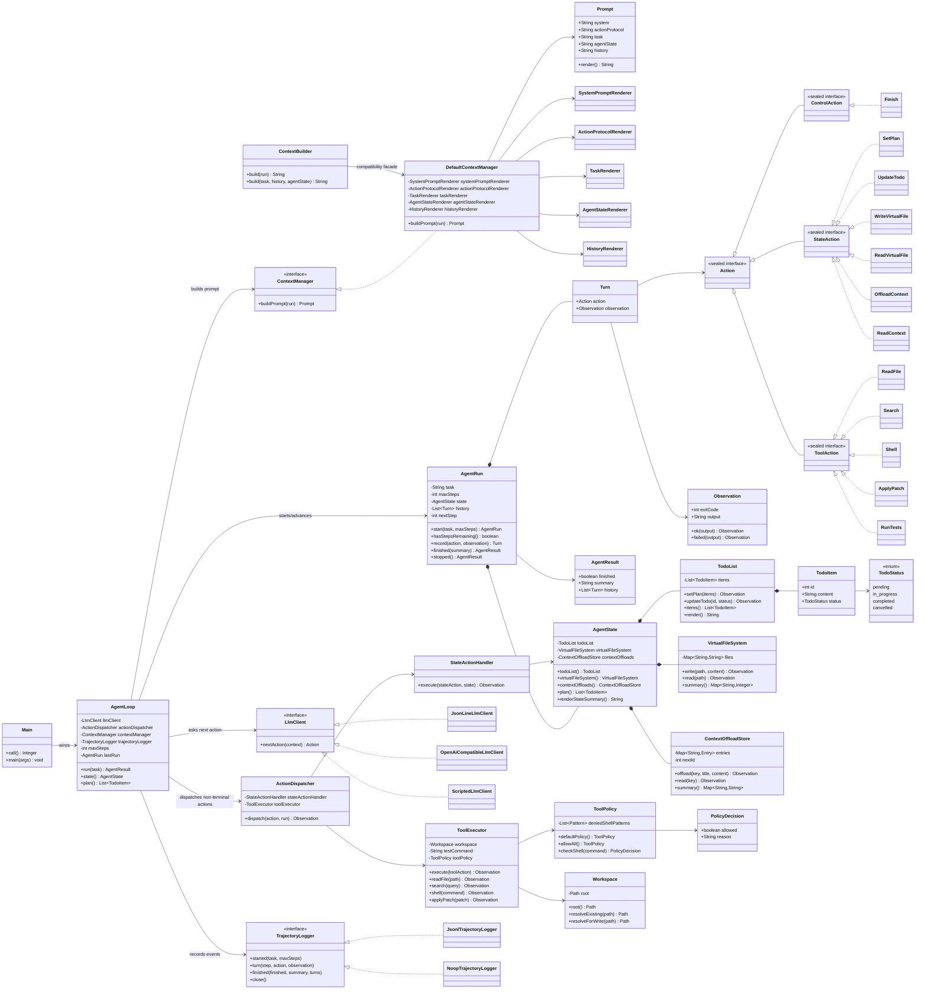

# sac-agent4j Class Diagram

This diagram records the class shape after introducing `AgentRun`, `ActionDispatcher`, `StateActionHandler`, the `ControlAction` / `StateAction` / `ToolAction` hierarchy, and the `ContextManager` prompt seam.

For architectural commentary, see [`ARCHITECTURE.md`](./ARCHITECTURE.md).



## Responsibility split

```text
AgentLoop          = time/control flow
AgentRun           = one run's lifecycle state
AgentState         = agent's inner world
Action             = typed model/runtime protocol
ContextManager     = attention/context boundary
Prompt             = structured prompt sections
ActionDispatcher   = action family routing
StateActionHandler = state mutation/read semantics
ToolExecutor       = external workspace/tool side effects
LlmClient          = model boundary
TrajectoryLogger   = trace boundary
```

## Why this is more OO than the previous shape

- `AgentLoop` no longer branches over every concrete action.
- `AgentLoop` depends on `ContextManager`, not a string-building concrete class.
- Prompt sections are represented by `Prompt` and independent renderers.
- `ToolExecutor` only accepts `ToolAction`; it no longer knows about state actions.
- `AgentState` no longer accepts action records; state mutation semantics moved to `StateActionHandler`.
- `AgentRun` owns history, state, step budget, and run result construction.
- The Java sealed hierarchy now expresses action ontology directly.
